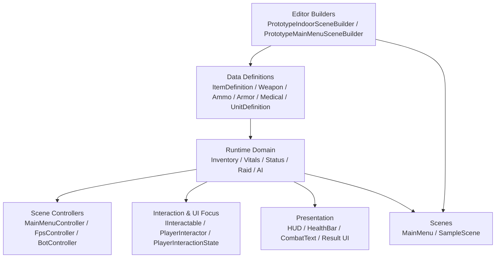
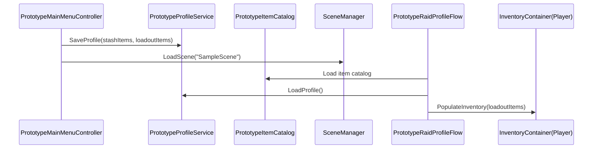
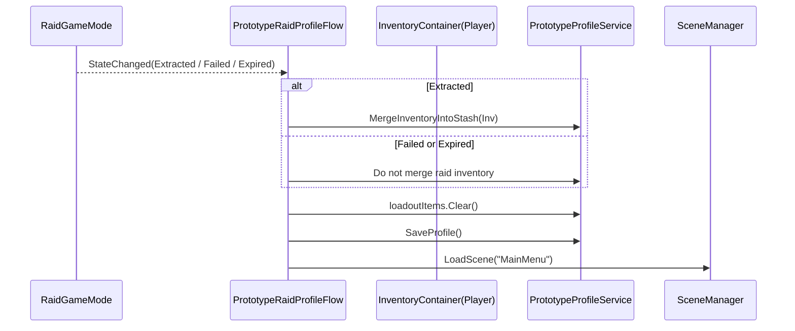
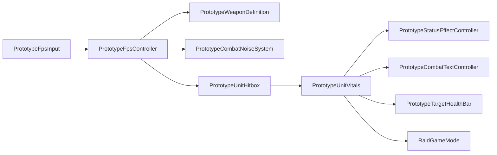
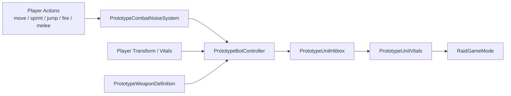
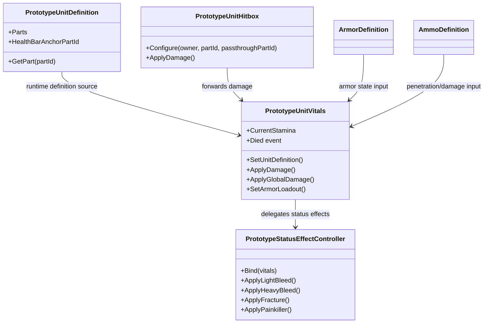
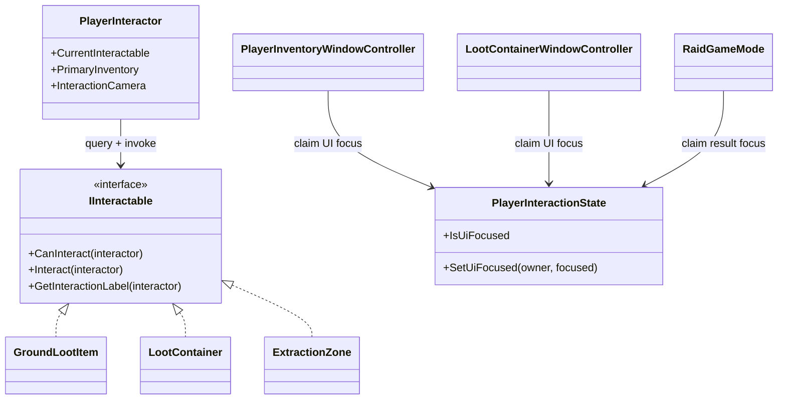
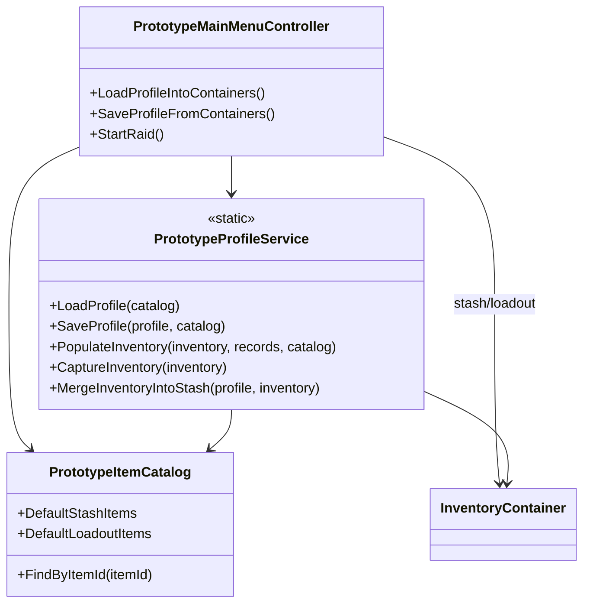

# Project-XX 架构与数据流参考

## 1. 目标

本文档用于回答三个问题：

1. 当前模块之间到底怎么依赖
2. 一条核心业务流具体经过哪些对象
3. 后续拆模块时哪些边界不能乱

本文档偏“图和参考”，不重复展开玩法说明。

配套文档：

- [PrototypeModuleDesign.md](D:/UnityProject/Project-XX/Project-XX/Docs/PrototypeModuleDesign.md)
- [InRaidCombatSystemDesign.md](D:/UnityProject/Project-XX/Project-XX/Docs/InRaidCombatSystemDesign.md)
- [MetaProfileAndWarehouseDesign.md](D:/UnityProject/Project-XX/Project-XX/Docs/MetaProfileAndWarehouseDesign.md)

---

## 2. 总体分层图



分层约束：

- `Data Definitions` 不依赖运行时控制器
- `Runtime Domain` 不应直接依赖具体菜单布局
- `Presentation` 只读取状态，不做核心结算
- `Editor Builders` 可以依赖任何运行时数据定义，但只在编辑器下执行

---

## 3. 局外到局内流转图



关键点：

- 主菜单不会把内存对象直接传给战斗场景
- 战斗场景总是重新从 `Profile + Catalog` 还原 loadout
- 这是当前场景切换的硬边界

---

## 4. 战局结算回写流



关键点：

- 结算写回入口统一在 `PrototypeRaidProfileFlow`
- `RaidGameMode` 负责状态，不直接写 Profile
- 这是一个比较健康的边界，后面应继续保持

---

## 5. 玩家战斗链路图



职责解释：

- `FpsInput` 只产出输入状态
- `FpsController` 负责控制与发起伤害
- `Hitbox` 只做命中映射
- `Vitals` 是伤害结算中心
- `StatusEffectController` 只做持续效果
- `RaidGameMode` 只消费“死亡/结算”层级的信息

---

## 6. AI 感知与攻击链路图



AI 当前对外依赖：

- 目标的 `Transform`
- 目标的 `PrototypeUnitVitals`
- 自身武器定义
- 全局噪声事件

这说明当前 AI 仍是一个较重的控制器，但依赖是清楚的。

---

## 7. 单位系统内部结构图



核心判断：

- `PrototypeUnitVitals` 是当前最核心的领域对象之一
- 它应该继续是“结算中心”，但不应该继续无限增胖

---

## 8. 交互系统结构图



设计意义：

- `IInteractable` 是局内交互统一门面
- `PlayerInteractionState` 是所有 UI 焦点统一门面
- 这两个接口/对象是当前局内系统最值得保护的边界

---

## 9. 主菜单与 Profile 结构图



关键点：

- `MainMenuController` 管 UI 和流程
- `ProfileService` 管序列化和容器转换
- `ItemCatalog` 管物品定义索引

这个分层目前是合理的。

---

## 10. 依赖红线

以下依赖当前不建议新增：

- `ItemDefinition` 反向依赖 `InventoryContainer`
- `PrototypeUnitDefinition` 反向依赖 `PrototypeFpsController`
- `RaidGameMode` 直接操作具体拾取物或武器逻辑
- `PrototypeMainMenuController` 直接参与局内伤害或结算逻辑
- UI 脚本直接调用 `Physics` 做战斗结算

原因：

- 这些都会打乱当前已经成形的层级
- 会让场景控制器逐渐变成“全能脚本”

---

## 11. 关键对象的归属建议

### 11.1 属于领域层

- `PrototypeUnitVitals`
- `PrototypeUnitDefinition`
- `PrototypeStatusEffectController`
- `InventoryContainer`
- `ItemInstance`
- `PrototypeProfileService`

### 11.2 属于控制层

- `PrototypeFpsController`
- `PrototypeBotController`
- `RaidGameMode`
- `PlayerInteractor`
- `PrototypeMainMenuController`
- `PrototypeRaidProfileFlow`

### 11.3 属于表现层

- `PrototypeCombatTextController`
- `PrototypeTargetHealthBar`
- 各类 IMGUI 面板

### 11.4 属于编辑器层

- `PrototypeIndoorSceneBuilder`
- `PrototypeMainMenuSceneBuilder`

---

## 12. 后续拆分建议

如果后面要做更正式的 asmdef 或目录重构，建议目标结构是：

```text
ProjectXX.Core
  ItemDefinition / ItemInstance / InventoryContainer
  UnitDefinition / UnitVitals / StatusEffectController

ProjectXX.Gameplay
  FpsController / BotController / RaidGameMode / Interaction

ProjectXX.Meta
  ProfileService / MainMenuController / RaidProfileFlow

ProjectXX.Presentation
  CombatText / HealthBar / HUD / Menu UI

ProjectXX.Editor
  Scene builders / editor-only tools
```

---

## 13. 结论

当前工程虽然还是原型，但架构已经有一条比较清楚的主干：

- 数据定义负责“可配置”
- 运行时领域对象负责“状态与结算”
- 控制器负责“驱动流程”
- UI 负责“读取与反馈”

这条主干如果后续守住，项目可以继续扩；如果打破，后面会迅速退化成脚本堆。
